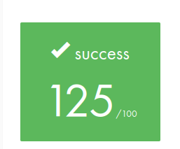
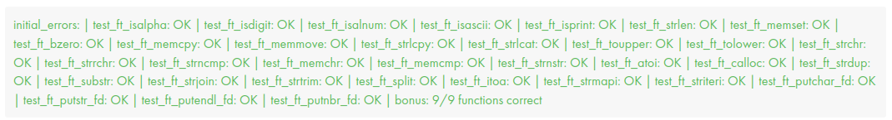

# libft-42




## Description

This is the first project for 42 students, where the goal is to create our own library with some well-known C functions.

There are over 30 mandatory functions, plus some bonus functions that involve a basic data structure: (Singly) Linked Lists.

## Tips

### 1. RTFM!

Read the `man` pages carefully and understand their expected behavior.

Sometimes the manual can be unclear, especially regarding null inputs or out-of-range values. In these cases, feel free to check out sites like Stack Overflow or consult AI tools! Just make sure you're not blindly copying and pasting.

### 2. Test before pushing!

Don't risk losing evaluation points! Some dedicated students have built useful testers that cover most of the edge cases that Moulinette might throw at you. I personally used [francinette](https://github.com/xicodomingues/francinette).

Here’s how to set it up on your machine:

1) Install it with the following command:

```bash
bash -c "$(curl -fsSL https://raw.github.com/xicodomingues/francinette/master/bin/install.sh)"
```

2) Navigate to the `francinette` directory and install the required Python libraries:

```python
python3 -m pip install -r requirements.txt
```

> **_NOTE:_** It’s a good idea to use a virtual environment. 
> You can create one with: `python3 -m venv .venv`. Then, activate it with: `source .venv/bin/activate` before running the command above.

3) Create an alias for running francinette:

Add the following line to your `.zshrc` file in your `home` directory:

```bash
alias paco="python3 /home/francinette/main.py"
```

4) Create a `Makefile` and test your functions!

You’ll need a `Makefile` to run the testers. Once it's set up, simply execute the following command in your project directory:
```bash
paco
```
